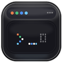

<div align="center">
  
  <h3 align="center">Vibe Hub</h3>
  <p align="center">
    A macOS app that brings a Dynamic Island-style overlay for monitoring Claude Code and OpenCode CLI sessions.
    <br />
    <br />
    <a href="https://github.com/mtunique/VibeHub/releases/latest" target="_blank" rel="noopener noreferrer">
      
    </a>
    <a href="https://github.com/mtunique/VibeHub/releases" target="_blank" rel="noopener noreferrer">
      
    </a>
    <a href="https://opensource.org/licenses/Apache-2.0" target="_blank" rel="noopener noreferrer">
      
    </a>
  </p>
</div>

## Features

- **Dynamic Island-style overlay** — Expands from the MacBook notch with smooth transitions
- **Menu bar mode** — Works on any Mac (with or without a notch)
- **Live session monitoring** — Track Claude Code and OpenCode CLI sessions in real-time
- **Permission approvals** — Approve/deny tool executions from the overlay
- **Chat history** — View conversation history with markdown rendering
- **Remote SSH support** — Monitor sessions running on remote servers
- **Multi-screen support** — Choose which screen shows the overlay
- **Auto-update & sounds** — Optional update checks and notification sounds

## Requirements

- macOS 15.6+
- Claude Code CLI
- MacBook with notch (for notch-based UI) or any Mac (fallback mode)

## Install

### Download

Download the latest release from the [Releases](https://github.com/mtunique/VibeHub/releases/latest) page.

### Build from Source

```bash
xcodebuild -scheme VibeHub -configuration Release build
```

The app will be built to `build/Release/VibeHub.app`.

## OpenCode Support

Vibe Hub also monitors OpenCode sessions.

## Remote SSH Support

You can monitor Claude sessions running on remote servers:

1. Open settings and add a remote host (SSH config supported)
2. Connect (optionally auto-connect on launch)
3. Remote sessions appear alongside local ones in the overlay

Configuration is stored in the app's settings and supports auto-connect on launch.

## Settings

Access settings by clicking the notch to expand it, then click the gear icon.

| Setting | Description |
|---------|-------------|
| **Screen** | Choose which monitor shows the notch |
| **Notification Sound** | Pick from 14 system sounds (or none) |
| **Remote Hosts** | Configure SSH connections to remote servers |

## Contributing

Contributions are welcome! Feel free to open an issue or submit a Pull Request.

## Acknowledgments

Vibe Hub is an evolution of [Claude Island](https://github.com/farouqaldori/claude-island).
See [NOTICE](NOTICE) for third-party license details.

## License

Apache 2.0 — See [LICENSE](LICENSE.md) for details.

This project links against [libssh](https://www.libssh.org/) which is licensed under LGPL-2.1. The libssh source code is available at https://git.libssh.org/projects/libssh.git/.
